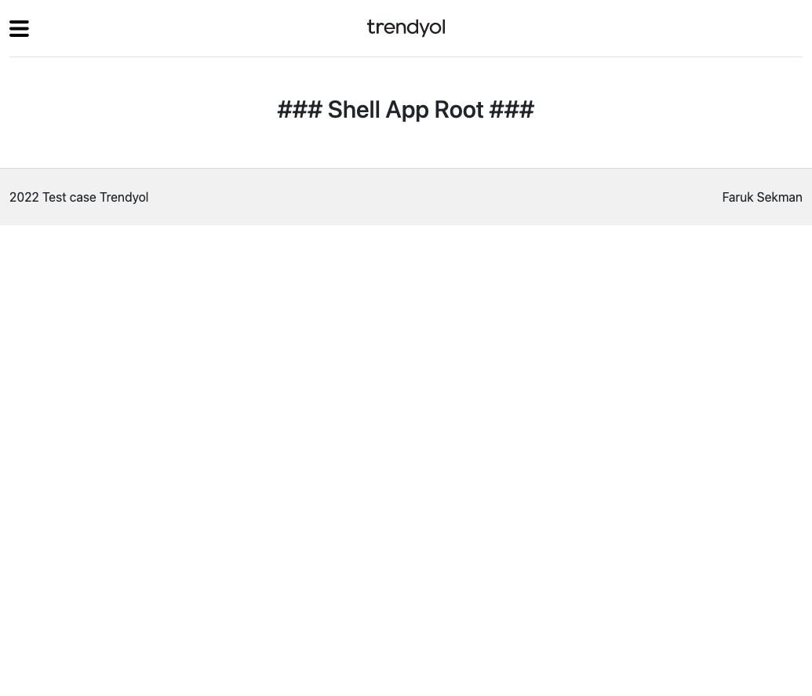

# Micro FrontEnd

## Project setup
```
npm install
```

### Compiles and hot-reloads for development
```
"scripts": {
    "ng": "ng",
    "start": "ng serve",
    "build": "ng build",
    "watch": "ng build --watch --configuration development",
    "test": "ng test",
    "run:all": "node node_modules/@angular-architects/module-federation/src/server/mf-dev-server.js"
  }
```
### All projects Run
```
"run:all": "node node_modules/@angular-architects/module-federation/src/server/mf-dev-server.js"
```
#### First window that opens
http://localhost:3000/ - Main App (Root: projects > container)
#### Second window that opens
http://localhost:3001/ - Store App (Root: projects > store)
#### Third window that opens
http://localhost:3002/ - Shell App (Root: projects > shell)
###

#
## Application Architecture Diagram

# First window that opens screen (MainApp)

####

####

#

# Second window that opens screen (StoreApp)

#

# Third window that opens screen (ShellApp)

####

#


### Compiles and minifies for production
```
npm run build
```
#
### Lints and fixes files
```
npm run lint
```

